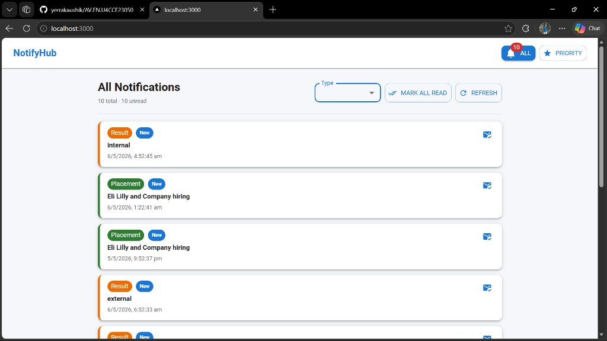

# NotifyHub - Student Notification Portal

NotifyHub is a real-time notification system designed for student portals, enabling seamless delivery and management of important announcements such as Results, Events, and Placement updates.

## Demo

Here is a visual demonstration of the NotifyHub interface in action:

### Screenshot

### Screen Recording
<video width="800" controls>
  <source src="./notification_app_fe/pub/Recording%202026-05-06%20162614.mp4" type="video/mp4">
  Your browser does not support the video tag.
</video>

## Architecture
For a detailed look at the system architecture, database schema, and technical decisions, please check the [Notification System Design Document](./notification.md).
